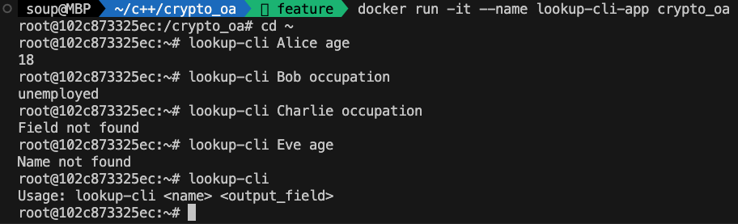

## Build Dockerfile
```
docker build -t crypto_oa .
```
## Run and enter into container
```sh
docker run -it --name lookup-cli-app crypto_oa
```
## Use lookup-cli command tool in the container
```sh
$ lookup-cli Alice age
18
$ lookup-cli Bob occupation
unemployed
$ lookup-cli Charlie occupation
Field not found
$ lookup-cli Eve age
Name not found
$ lookup-cli
Usage: lookup-cli <name> <output_field>
```
## Screenshot in container
